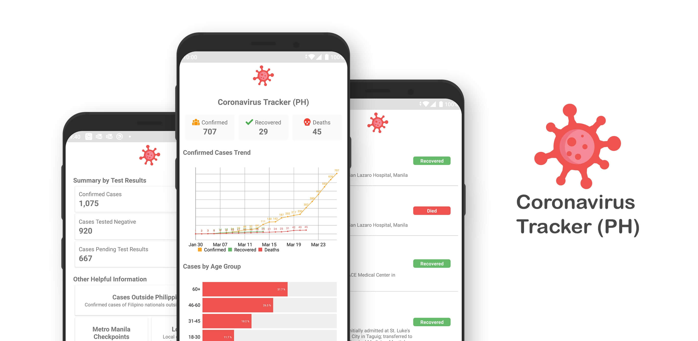
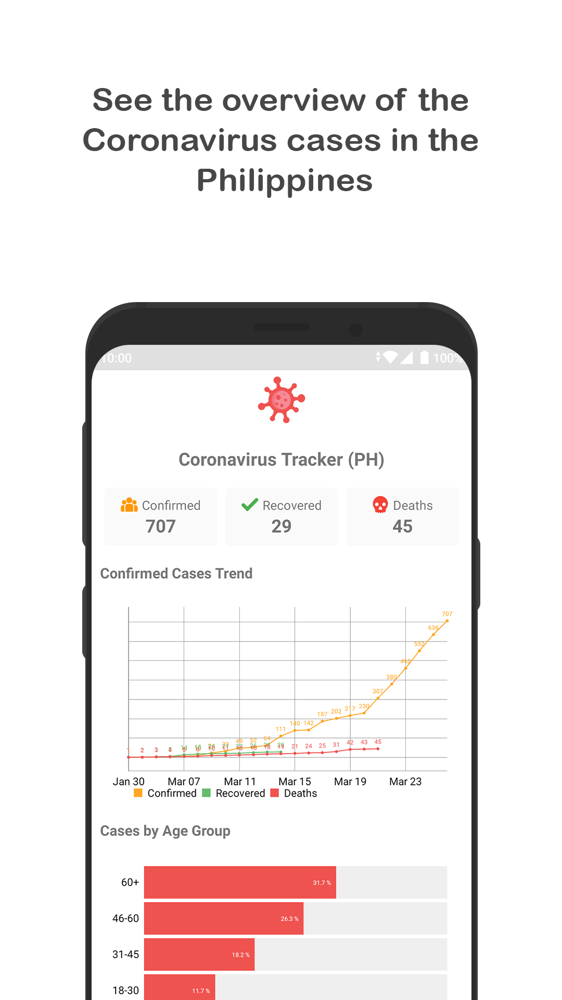
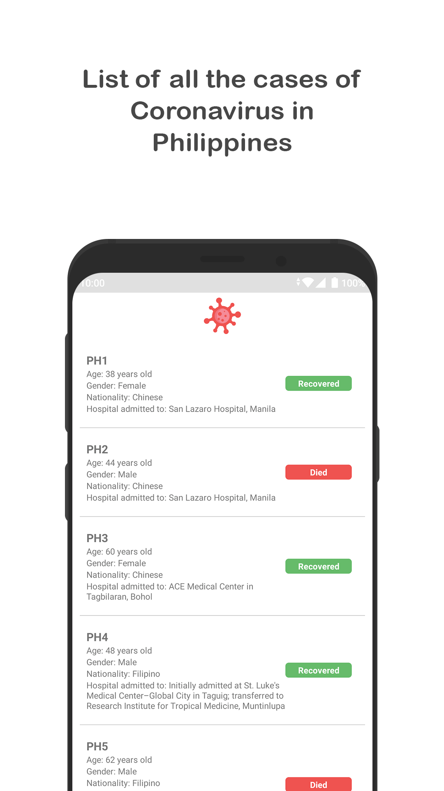
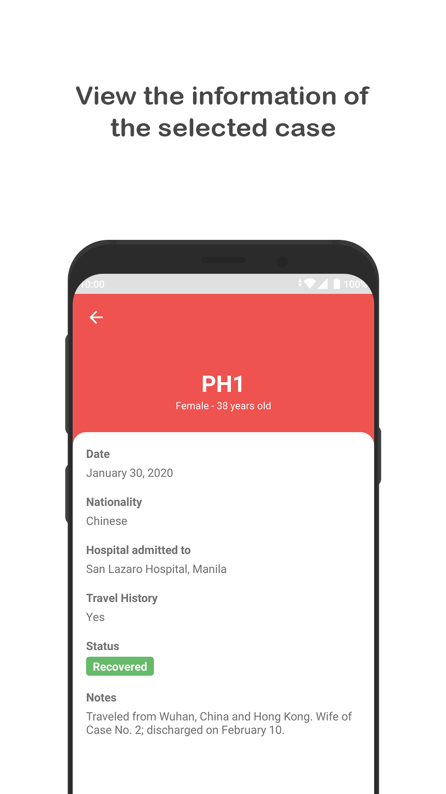
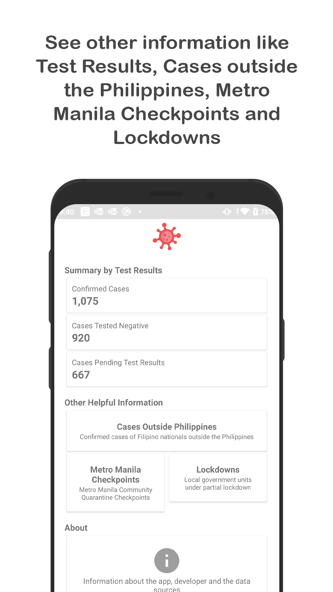
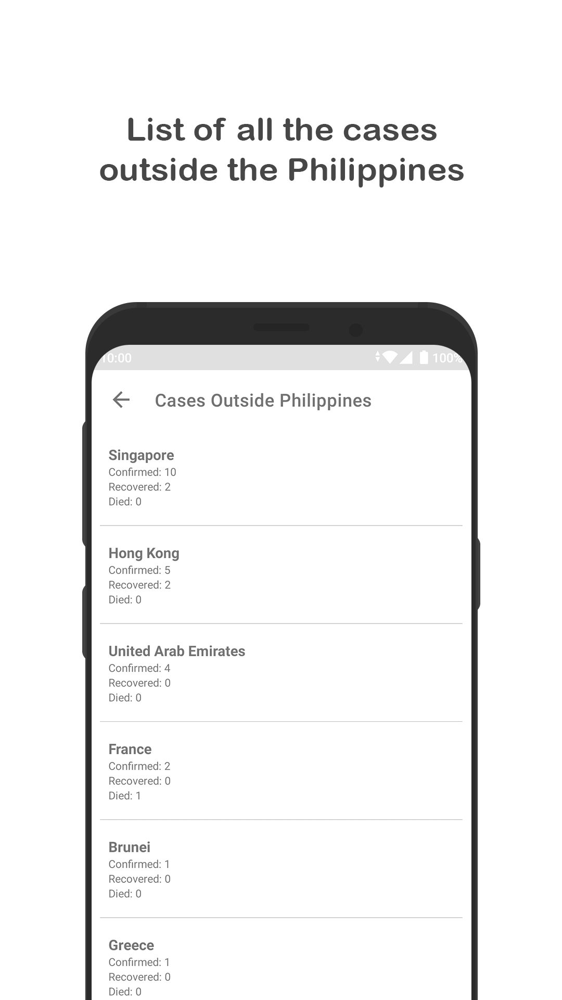
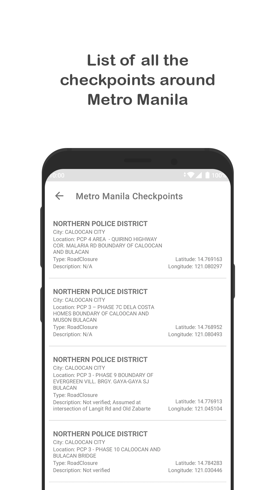
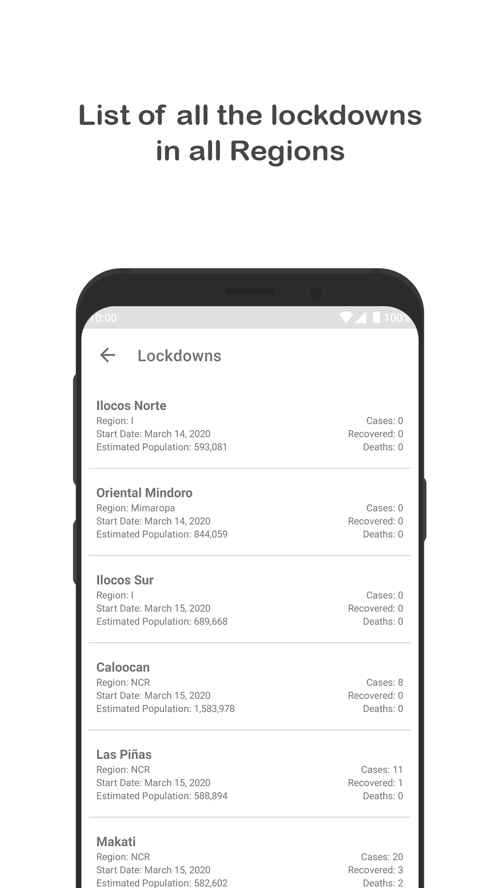

# Coronavirus Tracker (PH) #
[]()
[]()
[](https://raw.githubusercontent.com/jpjpjp28/Coronavirus-Tracker-PH/master/LICENSE)
[]()

<p align="center">
An app for tracking the Novel Coronavirus (COVID-19, SARS-CoV-2) outbreak in the Philippines.
</p>

<p align="center">

</p>

## Download / Visit Website ##
[](https://github.com/jpjpjp28/Coronavirus-Tracker-PH/raw/master/apk/Coronavirus_Tracker_PH_v1.2.0_20200415.apk)
[](https://jpjpjp28.github.io/Coronavirus-Tracker-PH/)

## Features ##
* Current data: Shows the most recent data. (Regularly updating)
* Charts:
  - Line Chart for the number of confirmed, recovered and deaths
  - Bar Chart for the percentage of confirmed based on Age
  - Pie Chart for the percentage of confirmed based on gender
* Philippine Cases: Shows all the case confirmed by DOH and its information.
* Test Results: Shows the summary by test results of confirmed cases, cases tested negative and cases pending test results.
* Global Cases: Show all the total cases around the world
* Other Information:
  - Cases outside the Philippines
  - Facilities
  - Metro Manila Checkpoints
  - Local Government Units lockdowns

<p align="center">







</p>

## Data Sources ##
* [NovelCOVID/API](https://github.com/NovelCOVID/API)
* [Worldometers](https://www.worldometers.info/coronavirus/)
* [Johns Hopkins University CSSE](https://github.com/CSSEGISandData/COVID-19)
* [WHO (World Health Organization)](https://www.who.int/emergencies/diseases/novel-coronavirus-2019/situation-reports/)
* [coronavirus-ph (API)](https://coronavirus-ph-api.herokuapp.com) by Robert C Soriano
* [Cases from r/Coronavirus_PH spreadsheet](https://www.reddit.com/r/Coronavirus_PH/comments/fehzke/ph_covid19_case_database_is_now_live/)
* [Metro Manila community quarantine checkpoints](https://safetravel.ph/)
* [Wikipedia](https://en.wikipedia.org/wiki/2020_coronavirus_pandemic_in_the_Philippines)

## Technologies and Libraries ##
Coronavirus Tracker (PH) is based on Kotlin MVVM clean architecture design pattern, repository pattern and material design & animations.
* Minimum SDK 16
* 100% Kotlin based
* MVVM Architecture
* Architecture Components (Lifecycle, LiveData, ViewModel)
* Kotlin Coroutines
* DataBinding
* Material Design & Animations
* [Firebase](https://firebase.google.com/) for analytics, crash reporting and remote config
* [Dagger2](https://github.com/google/dagger) for dependency injection
* [Retrofit2 & Moshi](https://github.com/square/retrofit) for constructing the REST API
* [OkHttp3](https://github.com/square/okhttp) for implementing interceptor, logging and mocking web server
* [Timber](https://github.com/JakeWharton/timber) for logging
* [LeakCanary](https://github.com/square/leakcanary) for memory leak detection
* [MPAndroidChart](https://github.com/PhilJay/MPAndroidChart) for displaying charts
* Ripple animation, Shared element transition

# Support #

If you feel like sponsoring me a coffee for my efforts, I would greatly appreciate it.

<a href="https://www.buymeacoffee.com/jpjpjp28" target="_blank"></a>


# License #
```
MIT License

Copyright (c) 2020 John Paul Custodio

Permission is hereby granted, free of charge, to any person obtaining a copy
of this software and associated documentation files (the "Software"), to deal
in the Software without restriction, including without limitation the rights
to use, copy, modify, merge, publish, distribute, sublicense, and/or sell
copies of the Software, and to permit persons to whom the Software is
furnished to do so, subject to the following conditions:

The above copyright notice and this permission notice shall be included in all
copies or substantial portions of the Software.

THE SOFTWARE IS PROVIDED "AS IS", WITHOUT WARRANTY OF ANY KIND, EXPRESS OR
IMPLIED, INCLUDING BUT NOT LIMITED TO THE WARRANTIES OF MERCHANTABILITY,
FITNESS FOR A PARTICULAR PURPOSE AND NONINFRINGEMENT. IN NO EVENT SHALL THE
AUTHORS OR COPYRIGHT HOLDERS BE LIABLE FOR ANY CLAIM, DAMAGES OR OTHER
LIABILITY, WHETHER IN AN ACTION OF CONTRACT, TORT OR OTHERWISE, ARISING FROM,
OUT OF OR IN CONNECTION WITH THE SOFTWARE OR THE USE OR OTHER DEALINGS IN THE
SOFTWARE.
```